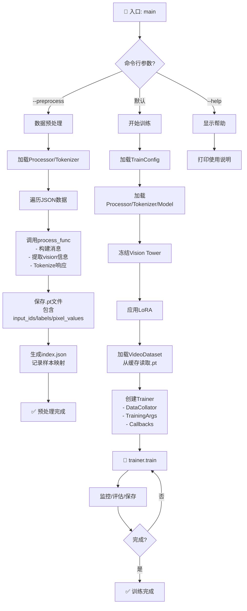

# train.py 流程框架图

## 执行流程



## 关键组件

| 组件 | 功能 |
|------|------|
| `TrainConfig` | 集中管理所有超参数 |
| `process_func` | 单个样本处理逻辑 |
| `QwenVideoDataCollator` | 批处理数据对齐 |
| `VideoDataset` | 从.pt文件加载数据 |
| `TrainingMonitorCallback` | 监控训练进度/显存 |
| `Trainer` | HuggingFace训练器 |

## 训练流程细节

```
加载模型
  ↓
冻结Vision (可选)
  ↓
应用LoRA (可选)
  ↓
加载数据集 ──→ Data Collator (padding/对齐)
  ↓
初始化Trainer
  ↓
[每个step]
  ├─ 前向传播 (input_ids → logits)
  ├─ 计算loss (只在labels != -100处)
  ├─ 反向传播
  ├─ 梯度积累 (8步后更新)
  └─ 日志/评估/保存
  ↓
训练完成 → 保存模型
```
